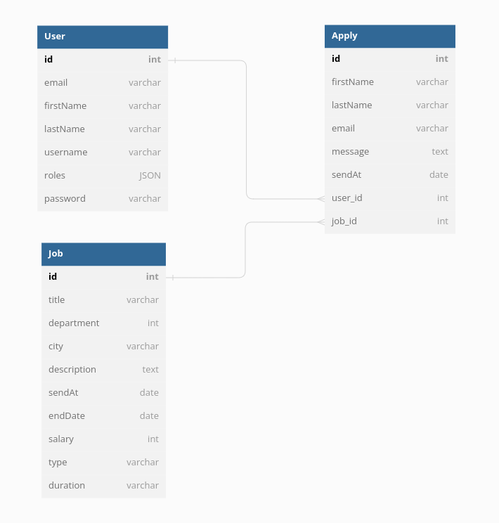

-------------------------------------------------------    

# Evaluation PHP - Site d'offres d'emplois  

## Refaire un site d'offres d'emplois de type Pole emploi.  

Utilisation du framework symfony. 

Fonctionnalités :  
* Base de données  
* Liste d'offres d'emplois  
* Page avec détail d'une offre  
* Formulaire pour postuler à une offre  
* Pagination  
* Filtre des offres et tri par date  
* Interface admin (crud)  
* Inscription, connexion __(ROLE_ADMIN non automatique, il faudra le modifier dans la base de données pour avoir accès aux pages admin)__
  
  
  ### Base de données :  
  
